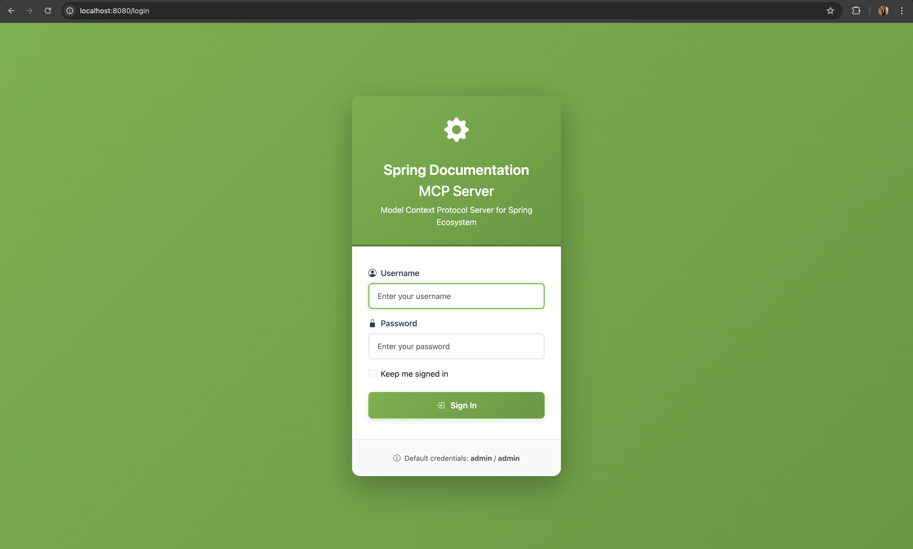
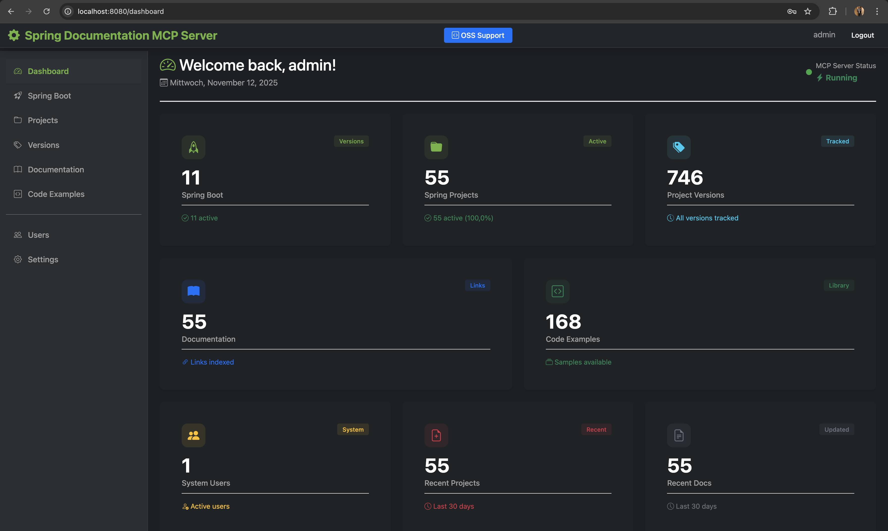
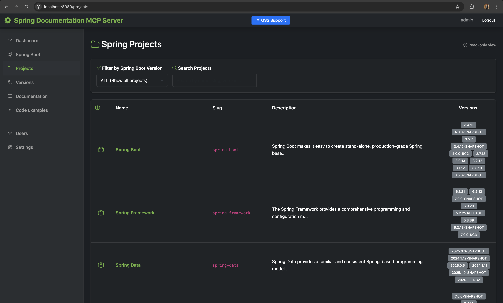
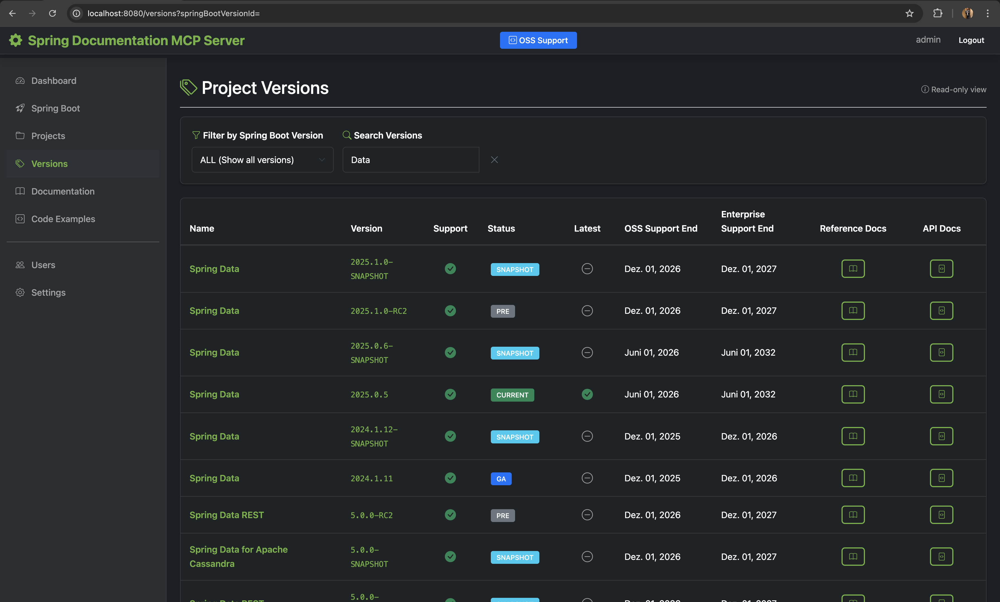
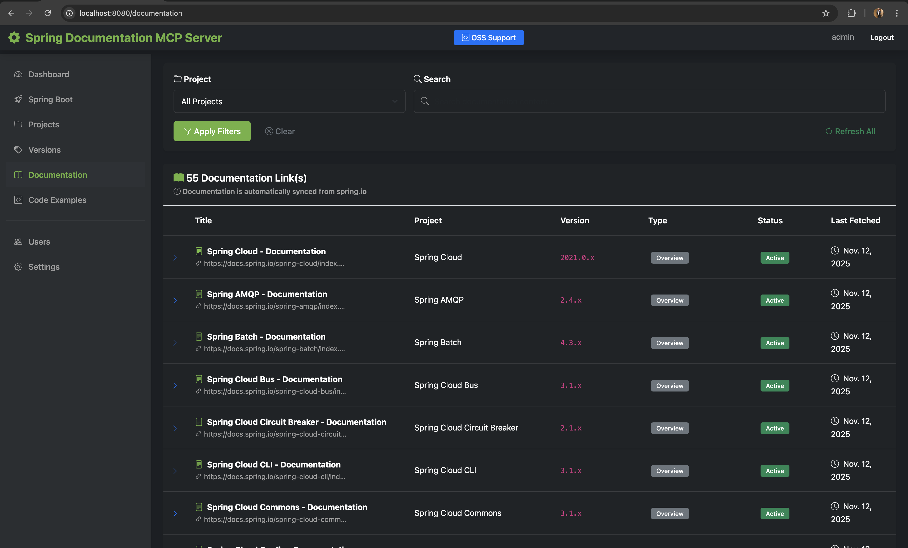
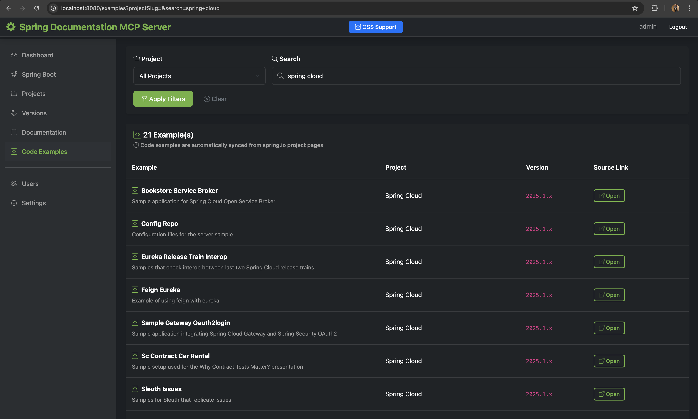
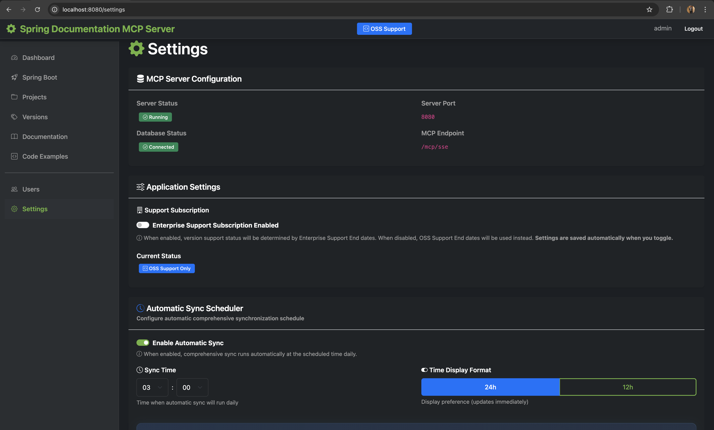
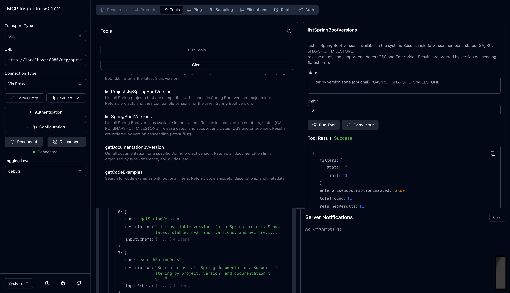
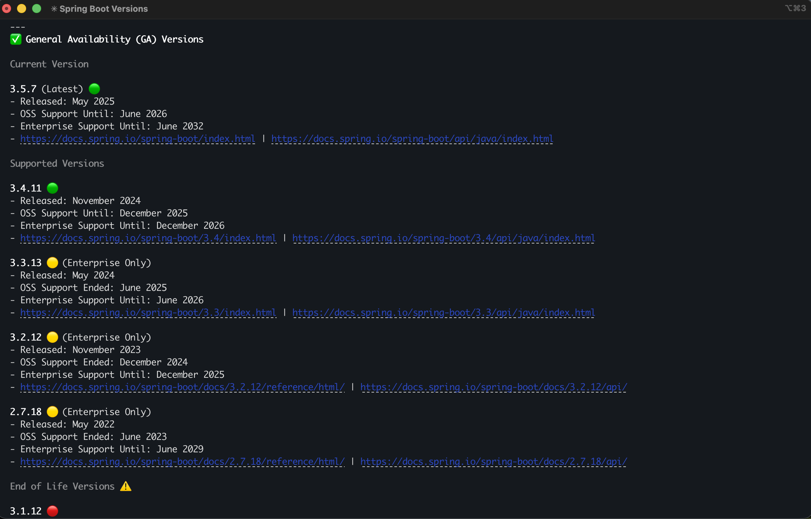
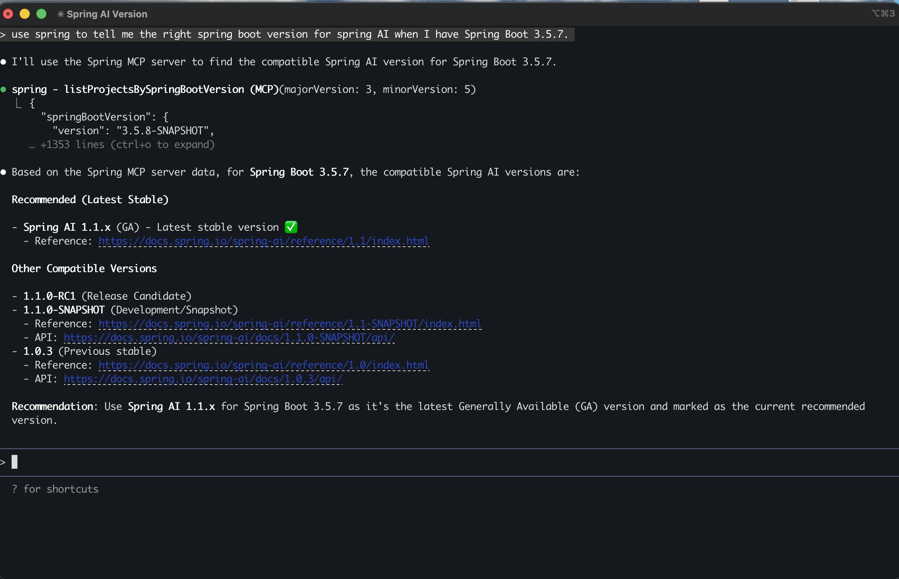

# Spring Documentation MCP Server

A comprehensive Spring Boot application that serves as a Model Context Protocol (MCP) Server, providing AI assistants with full-text searchable access to Spring ecosystem documentation via Server-Sent Events (SSE).

## What is this?

This MCP server enables AI assistants (like Claude) to search, browse, and retrieve Spring Framework documentation, code examples, and API references. It includes:

- **MCP Server**: SSE-based protocol implementation using Spring AI
- **Documentation Sync**: Automated synchronization from spring.io
- **Full-Text Search**: PostgreSQL-powered search across all Spring documentation
- **Web Management UI**: Thymeleaf-based interface for managing projects, versions, and documentation
- **Code Examples**: Searchable repository of Spring code snippets

## Screenshots

<table>
  <tr>
    <td width="50%">
      
      <p align="center"><b>Login</b> - Secure authentication with Spring Security</p>
    </td>
    <td width="50%">
      
      <p align="center"><b>Dashboard</b> - Overview statistics and quick actions</p>
    </td>
  </tr>
  <tr>
    <td width="50%">
      
      <p align="center"><b>Spring Boot</b> - Spring Boot project management</p>
    </td>
    <td width="50%">
      
      <p align="center"><b>Projects</b> - All Spring projects overview</p>
    </td>
  </tr>
  <tr>
    <td width="50%">
      
      <p align="center"><b>Project Details</b> - Spring Batch project details</p>
    </td>
    <td width="50%">
      
      <p align="center"><b>Versions</b> - Version management and tracking</p>
    </td>
  </tr>
  <tr>
    <td width="50%">
      
      <p align="center"><b>Documentation</b> - Full-text search and browse</p>
    </td>
    <td width="50%">
      
      <p align="center"><b>Code Examples</b> - Searchable code snippets library with language and tag filters</p>
    </td>
  </tr>
  <tr>
    <td width="50%">
      
      <p align="center"><b>Settings</b> - Application configuration, scheduler, and sync controls</p>
    </td>
    <td width="50%">
      
      <p align="center"><b>Documentation Markdown</b> - Expanded Spring Batch documentation content</p>
    </td>
  </tr>
  <tr>
    <td width="50%">
      
      <p align="center"><b>MCP Inspector</b> - MCP Inspector connected to Spring Documentation MCP Server</p>
    </td>
    <td width="50%">
      
      <p align="center"><b>Claude Code Integration</b> - Claude Code console listing all Spring Boot versions via MCP</p>
    </td>
  </tr>
  <tr>
    <td width="50%">
      
      <p align="center"><b>Spring AI Compatibility</b> - Claude using MCP to find compatible Spring AI version for Spring Boot 3.5.7</p>
    </td>
    <td width="50%">
    </td>
  </tr>
</table>

## Current Status

### ✅ Fully Implemented Features

#### MCP Tools (10 tools available)
1. **searchSpringDocs** - Full-text search across all Spring documentation with filters
2. **getSpringVersions** - List available versions for any Spring project
3. **listSpringProjects** - Browse all available Spring projects
4. **getDocumentationByVersion** - Get all documentation for a specific version
5. **getCodeExamples** - Search code examples with language/project/version filters
6. **listSpringBootVersions** - List Spring Boot versions with state filtering
7. **getLatestSpringBootVersion** - Get latest patch for major.minor version
8. **filterSpringBootVersionsBySupport** - Filter by support status (OSS/Enterprise)
9. **listProjectsBySpringBootVersion** - List compatible projects for Spring Boot version
10. **findProjectsByUseCase** - Search projects by use case keywords

#### Web Management UI
- **Dashboard** - Overview statistics and recent updates
- **Projects** - Manage Spring projects (Spring Boot, Framework, Data, Security, Cloud, etc.)
- **Versions** - Version management with latest/default marking
- **Documentation** - Browse and search documentation links with full-text search
- **Code Examples** - Code snippet library with tagging
- **Users** - User management with role-based access
- **Settings** - Application configuration, feature toggles, and API Key Management
- **Authentication** - Spring Security with session management
- **API Key Management** - Secure token-based authentication for MCP endpoints

#### Documentation Sync Services
- Automated sync from spring.io/projects
- Version detection and tracking
- Spring Boot version synchronization
- Project relationship mapping
- Spring Generations support
- Scheduled updates (configurable cron)
- Bootstrap data loading

#### Database Features
- PostgreSQL 18 with full-text search (tsvector)
- Flyway migrations for version control
- Optimized indexes for search performance
- Support for relationships and metadata

## Prerequisites

**IMPORTANT**: This project requires **Java 25** (LTS).

### Install Java 25

#### Option 1: SDKMAN (Recommended)
```bash
# Install SDKMAN
curl -s "https://get.sdkman.io" | bash

# Install Java 25
sdk install java 25.0.1-tem

# Use Java 25
sdk use java 25.0.1-tem
```

#### Option 2: Download from Adoptium
- Download from: https://adoptium.net/temurin/releases/?version=25
- Install and set JAVA_HOME

#### Option 3: Homebrew (macOS)
```bash
brew install openjdk@25
```

### Verify Installation
```bash
java -version
# Should show: openjdk version "25"
```

## Quick Start

### 1. Start PostgreSQL Database
```bash
docker-compose up -d postgres
```

### 2. Verify Database is Running
```bash
docker-compose ps
# You should see spring-mcp-db with status "Up" and "healthy"
```

### 3. Build the Application
```bash
./gradlew clean build
```

### 4. Run the Application
```bash
java -jar build/libs/spring-mcp-server-1.0.0.jar
```

Or using Gradle:
```bash
./gradlew bootRun
```

### 5. Access the Application

- **Web UI**: http://localhost:8080
- **Login**: Username: `admin`, Password: `admin`
- **MCP SSE Endpoint**: http://localhost:8080/mcp/spring/sse
- **MCP Message Endpoint**: http://localhost:8080/mcp/spring/messages

## API Key Authentication

### Creating an API Key


*API Key Management interface with secure key generation, activation/deactivation controls, and confirmation modals*

The MCP endpoints are protected by secure API key authentication. To create an API key:

1. **Log in to the Web UI** at http://localhost:8080 (Username: `admin`, Password: `admin`)
2. **Navigate to Settings** (`/settings`)
3. **Scroll to "API Key Management"** section
4. **Click "Create New API Key"** button
5. **Enter details**:
   - **Name**: Unique identifier for this key (minimum 3 characters)
   - **Description**: Optional purpose description
6. **Click "Create API Key"**
7. **⚠️ IMPORTANT**: Copy the API key immediately - it will only be shown once!

**API Key Format**: `smcp_<secure-random-string>` (256-bit cryptographically secure)

**Security Features**:
- Keys are hashed using BCrypt (cost factor 12) - never stored in plain text
- Support for activate/deactivate (soft delete)
- Last used timestamp tracking for auditing

### Using API Keys

API keys can be provided in three ways (in order of preference):

1. **X-API-Key Header** (Recommended):
   ```bash
   curl -H "X-API-Key: smcp_your_key_here" http://localhost:8080/mcp/spring/sse
   ```

2. **Authorization Bearer Header**:
   ```bash
   curl -H "Authorization: Bearer smcp_your_key_here" http://localhost:8080/mcp/spring/sse
   ```

3. **Query Parameter** (Testing only - less secure):
   ```bash
   curl "http://localhost:8080/mcp/spring/sse?api_key=smcp_your_key_here"
   ```

## Testing the MCP Server

### Option 1: MCP Inspector (Recommended for Testing)

MCP Inspector is an excellent tool for testing and debugging MCP servers. It provides a visual interface to test all MCP capabilities.

#### Install and Run MCP Inspector

```bash
npx @modelcontextprotocol/inspector
```

This will start the MCP Inspector and output something like:

```
Starting MCP inspector...
Proxy server listening on localhost:6277
Session token: 3c672c3389d66786f32ffe2f90d6d2116634bef316a09198fb6e933a5eeefe2b

MCP Inspector is up and running at:
http://localhost:6274/?MCP_PROXY_AUTH_TOKEN=3c672c3389d66786f32ffe2f90d6d2116634bef316a09198fb6e933a5eeefe2b
```

#### Configure MCP Inspector

1. Open the MCP Inspector URL in your browser
2. Select **"SSE"** as the Transport Type
3. Enter the **URL**: `http://localhost:8080/mcp/spring/sse`
4. Add **Headers** (click "Add Header"):
   - **Header Name**: `X-API-Key`
   - **Header Value**: `smcp_your_api_key_here` (your actual API key)
5. Click **"Connect"**

Once connected, you can:
- **List Tools**: View all 10 available MCP tools
- **Test Tools**: Execute tools with parameters and see responses
- **View Logs**: See real-time communication between client and server
- **Debug Issues**: Inspect request/response payloads

#### Example: Testing searchSpringDocs Tool

In MCP Inspector:
1. Navigate to the **"Tools"** tab
2. Select **"searchSpringDocs"** tool
3. Fill in parameters:
   ```json
   {
     "query": "autoconfiguration",
     "project": "spring-boot",
     "version": "3.5.7"
   }
   ```
4. Click **"Execute"**
5. View the typed response with all documentation results

### Option 2: Claude Desktop/Claude Code

Add to your Claude Desktop or Claude Code MCP configuration (`.mcp.json`):

```json
{
  "mcpServers": {
    "spring-documentation": {
      "type": "sse",
      "url": "http://localhost:8080/mcp/spring/sse",
      "headers": {
        "X-API-Key": "YOUR_API_KEY_HERE"
      }
    }
  }
}
```

**Configuration Steps**:
1. Create or edit `.mcp.json` in your project root or Claude Code configuration directory
2. Replace `YOUR_API_KEY_HERE` with your actual API key from the Settings page
3. Restart Claude Code to load the new MCP server
4. The Spring Documentation tools will be available in your Claude Code session

**Note**: The API key format is `smcp_<random-string>`. Get your key from the Web UI Settings page.

### Available MCP Tools

Once connected, the following **10 tools** are available to AI assistants:

#### Documentation Tools

##### 1. searchSpringDocs
Search across all Spring documentation with optional filters.

**Parameters**:
- `query` (required): Search term
- `project` (optional): Project slug (e.g., `spring-boot`)
- `version` (optional): Version string (e.g., `3.5.7`)
- `docType` (optional): Documentation type (e.g., `reference`, `api`)

**Example**:
```json
{
  "query": "autoconfiguration",
  "project": "spring-boot",
  "version": "3.5.7"
}
```

##### 2. getSpringVersions
List all available versions for a Spring project.

**Parameters**:
- `project` (required): Project slug

**Example**:
```json
{
  "project": "spring-boot"
}
```

##### 3. listSpringProjects
List all available Spring projects.

**No parameters required**.

##### 4. getDocumentationByVersion
Get all documentation for a specific project version.

**Parameters**:
- `project` (required): Project slug
- `version` (required): Version string

**Example**:
```json
{
  "project": "spring-framework",
  "version": "6.2.1"
}
```

##### 5. getCodeExamples
Search code examples with filters.

**Parameters**:
- `query` (optional): Search in title/description
- `project` (optional): Project slug
- `version` (optional): Version string
- `language` (optional): Programming language
- `limit` (optional): Max results (default: 10, max: 50)

**Example**:
```json
{
  "query": "REST controller",
  "project": "spring-boot",
  "language": "java",
  "limit": 20
}
```

#### Spring Boot Version Tools

##### 6. listSpringBootVersions
List all Spring Boot versions with optional filtering.

**Parameters**:
- `state` (optional): Filter by state ('GA', 'RC', 'SNAPSHOT', 'MILESTONE')
- `limit` (optional): Max results (default: 20, max: 100)

**Example**:
```json
{
  "state": "GA",
  "limit": 10
}
```

##### 7. getLatestSpringBootVersion
Get the latest patch version for a specific Spring Boot major.minor version.

**Parameters**:
- `majorVersion` (required): Major version (e.g., 3)
- `minorVersion` (required): Minor version (e.g., 5)

**Example**:
```json
{
  "majorVersion": 3,
  "minorVersion": 5
}
```

##### 8. filterSpringBootVersionsBySupport
Filter Spring Boot versions by support status.

**Parameters**:
- `supportActive` (optional): true for supported, false for end-of-life
- `limit` (optional): Max results (default: 20, max: 100)

**Example**:
```json
{
  "supportActive": true,
  "limit": 20
}
```

##### 9. listProjectsBySpringBootVersion
List all Spring projects compatible with a specific Spring Boot version.

**Parameters**:
- `majorVersion` (required): Spring Boot major version
- `minorVersion` (required): Spring Boot minor version

**Example**:
```json
{
  "majorVersion": 3,
  "minorVersion": 5
}
```

##### 10. findProjectsByUseCase
Search for Spring projects by use case keywords.

**Parameters**:
- `useCase` (required): Use case keyword (e.g., 'data access', 'security', 'messaging')

**Example**:
```json
{
  "useCase": "security"
}
```

## Configuration

### Environment Variables

```bash
# Database Configuration
export DB_HOST=localhost
export DB_PORT=5432
export DB_NAME=spring_mcp
export DB_USER=postgres
export DB_PASSWORD=postgres

# Security
export ADMIN_USER=admin
export ADMIN_PASSWORD=changeme

# Server
export SERVER_PORT=8080

# Documentation Bootstrap
export BOOTSTRAP_DOCS=false  # Set to true to load sample data on startup
```

### Application Configuration

Key configuration in `src/main/resources/application.yml`:

```yaml
spring:
  ai:
    mcp:
      server:
        name: "spring-documentation-server"
        type: "sync"
        version: "1.0.0"
        instructions: |
          Spring Documentation MCP Server provides comprehensive access...

        sse-endpoint: /mcp/spring/sse
        sse-message-endpoint: /mcp/spring/messages

        capabilities:
          tool: true
          completion: false
          prompt: false
          resource: false

mcp:
  documentation:
    fetch:
      enabled: true
      schedule: "0 0 2 * * ?"  # Daily at 2 AM

    bootstrap:
      enabled: ${BOOTSTRAP_DOCS:false}
      on-startup: false
      projects:
        - spring-boot
        - spring-framework
        - spring-data
        - spring-security
        - spring-cloud

    search:
      max-results: 50
      default-limit: 20
```

## Technology Stack

### Core Framework
- **Spring Boot**: 3.5.7
- **Java**: 25 (LTS)
- **Build Tool**: Gradle 9.2.0

### MCP Protocol
- **Spring AI MCP Server**: 1.0.3
- **Protocol**: Server-Sent Events (SSE)
- **Auto-discovery**: `@Tool` annotations

### Data Layer
- **Database**: PostgreSQL 18
- **ORM**: Spring Data JPA / Hibernate 6.6
- **Migrations**: Flyway
- **Full-Text Search**: PostgreSQL tsvector + tsquery

### UI Layer
- **Template Engine**: Thymeleaf 3.1
- **Layout**: Thymeleaf Layout Dialect
- **CSS Framework**: Bootstrap 5
- **Security**: Spring Security 6 (Spring Security Extras for Thymeleaf)

### Documentation Fetching
- **HTML Parsing**: JSoup 1.21.2
- **JavaScript Support**: HtmlUnit 4.18.0
- **HTML to Markdown**: Flexmark 0.64.8
- **HTTP Client**: Spring WebFlux WebClient

### Security & Monitoring
- **Authentication**: Spring Security Basic Auth
- **Session Management**: HTTP Session
- **Health Checks**: Spring Boot Actuator
- **Logging**: Logback

## Project Structure

```
spring-mcp-server/
├── src/main/java/com/spring/mcp/
│   ├── config/                    # Spring configuration
│   │   ├── CacheConfig.java       # Caching configuration
│   │   ├── McpConfig.java         # MCP server tool registration
│   │   ├── McpHealthIndicator.java # Health check for MCP server
│   │   ├── SecurityConfig.java    # Security & authentication
│   │   ├── StartupSyncRunner.java # Startup sync initialization
│   │   ├── WebClientConfig.java   # WebClient for HTTP requests
│   │   └── WebMvcConfig.java      # Web MVC configuration
│   ├── controller/
│   │   ├── advice/                # Controller advice
│   │   │   └── GlobalModelAttributesAdvice.java # Global model attributes
│   │   ├── api/                   # REST API controllers
│   │   │   ├── DocumentationApiController.java
│   │   │   └── McpTestController.java
│   │   └── web/                   # Web UI controllers
│   │       ├── BootstrapController.java
│   │       ├── DashboardController.java
│   │       ├── DocumentationController.java
│   │       ├── ExamplesController.java
│   │       ├── ProjectsController.java
│   │       ├── SettingsController.java
│   │       ├── SpringBootController.java
│   │       ├── SyncController.java
│   │       ├── UsersController.java
│   │       └── VersionsController.java
│   ├── model/
│   │   ├── entity/                # JPA entities
│   │   │   ├── ApiKey.java
│   │   │   ├── CodeExample.java
│   │   │   ├── DocumentationContent.java
│   │   │   ├── DocumentationLink.java
│   │   │   ├── DocumentationType.java
│   │   │   ├── ExternalDoc.java
│   │   │   ├── McpConnection.java
│   │   │   ├── McpRequest.java
│   │   │   ├── ProjectRelationship.java
│   │   │   ├── ProjectVersion.java
│   │   │   ├── SchedulerSettings.java
│   │   │   ├── Settings.java
│   │   │   ├── SpringBootCompatibility.java
│   │   │   ├── SpringBootVersion.java
│   │   │   ├── SpringProject.java
│   │   │   └── User.java
│   │   └── dto/                   # Data Transfer Objects
│   │       ├── mcp/               # MCP response DTOs
│   │       │   ├── SearchDocsResponse.java
│   │       │   ├── VersionsResponse.java
│   │       │   ├── ProjectsListResponse.java
│   │       │   ├── DocumentationByVersionResponse.java
│   │       │   ├── CodeExamplesResponse.java
│   │       │   ├── SpringBootVersionsResponse.java
│   │       │   ├── LatestSpringBootVersionResponse.java
│   │       │   ├── FilteredSpringBootVersionsResponse.java
│   │       │   ├── ProjectsBySpringBootVersionResponse.java
│   │       │   └── ProjectsByUseCaseResponse.java
│   │       └── ... (other DTOs)
│   ├── repository/                # Spring Data JPA repositories
│   │   ├── ApiKeyRepository.java
│   │   ├── CodeExampleRepository.java
│   │   ├── DocumentationContentRepository.java
│   │   ├── DocumentationLinkRepository.java
│   │   ├── DocumentationTypeRepository.java
│   │   ├── ExternalDocRepository.java
│   │   ├── McpConnectionRepository.java
│   │   ├── McpRequestRepository.java
│   │   ├── ProjectRelationshipRepository.java
│   │   ├── ProjectVersionRepository.java
│   │   ├── SchedulerSettingsRepository.java
│   │   ├── SpringBootCompatibilityRepository.java
│   │   ├── SpringBootVersionRepository.java
│   │   ├── SpringProjectRepository.java
│   │   └── UserRepository.java
│   ├── service/
│   │   ├── tools/
│   │   │   └── SpringDocumentationTools.java  # MCP @Tool methods
│   │   ├── documentation/
│   │   │   ├── DocumentationFetchService.java
│   │   │   └── DocumentationService.java
│   │   ├── indexing/              # Content indexing services
│   │   │   ├── CodeExampleExtractor.java
│   │   │   └── DocumentationIndexer.java
│   │   ├── mcp/
│   │   │   └── McpRequestLoggerService.java
│   │   ├── scheduler/             # Scheduler services
│   │   │   └── SchedulerService.java
│   │   ├── sync/                  # Documentation sync services
│   │   │   ├── ComprehensiveSyncService.java
│   │   │   ├── DocumentationSyncService.java
│   │   │   ├── ProjectSyncService.java
│   │   │   ├── SpringBootVersionSyncService.java
│   │   │   ├── SpringGenerationsSyncService.java
│   │   │   └── SpringProjectPageCrawlerService.java
│   │   ├── version/
│   │   │   └── VersionDetectionService.java
│   │   ├── bootstrap/
│   │   │   └── DocumentationBootstrapService.java
│   │   ├── ApiKeyService.java
│   │   ├── CodeExampleService.java
│   │   ├── ExternalDocService.java
│   │   ├── ProjectRelationshipService.java
│   │   ├── ProjectService.java
│   │   ├── SettingsService.java
│   │   ├── SpringBootCompatibilityService.java
│   │   ├── SpringBootService.java
│   │   └── UserService.java
│   └── SpringMcpServerApplication.java
├── src/main/resources/
│   ├── db/migration/              # Flyway database migrations
│   │   └── V1__init.sql           # Consolidated initial schema
│   ├── templates/                 # Thymeleaf templates
│   │   ├── layouts/               # Page layouts
│   │   ├── fragments/             # Reusable fragments
│   │   ├── dashboard/
│   │   ├── projects/
│   │   ├── versions/
│   │   ├── documentation/
│   │   ├── examples/
│   │   ├── users/
│   │   └── settings/
│   ├── static/                    # CSS, JS, images
│   │   ├── css/
│   │   ├── js/
│   │   └── images/
│   └── application.yml            # Application configuration
├── docker-compose.yml             # PostgreSQL service
└── build.gradle                   # Gradle build configuration
```

## Database Schema

### Core Tables

- **spring_projects** - Spring ecosystem projects (Boot, Framework, Data, etc.)
- **project_versions** - Version tracking with state (STABLE, RC, SNAPSHOT)
- **documentation_types** - Types of documentation (Reference, API, Guide, Tutorial)
- **documentation_links** - Links to documentation resources
- **documentation_content** - Cached documentation with full-text search index
- **code_examples** - Code snippets with tags and metadata
- **users** - Application users with roles
- **settings** - Application-wide settings

### Full-Text Search

PostgreSQL tsvector is used for efficient full-text search:

```sql
-- Search query example
SELECT dl.id
FROM documentation_content dc
JOIN documentation_links dl ON dc.link_id = dl.id
WHERE dc.indexed_content @@ plainto_tsquery('english', 'spring boot autoconfiguration')
ORDER BY ts_rank_cd(dc.indexed_content, plainto_tsquery('english', 'spring boot autoconfiguration')) DESC
```

## Development

### Running Tests
```bash
./gradlew test
```

### Running with Dev Tools
```bash
./gradlew bootRun
# Dev tools will auto-reload on file changes
```

### Database Migrations

View migration status:
```bash
./gradlew flywayInfo
```

Migrations are applied automatically on startup. Manual migration:
```bash
./gradlew flywayMigrate
```

### Cleaning Build
```bash
./gradlew clean
./gradlew build --refresh-dependencies
```

## API Endpoints

### Web UI
- `GET /` - Dashboard
- `GET /projects` - Projects list
- `GET /versions` - Versions list
- `GET /documentation` - Documentation list with search
- `GET /examples` - Code examples
- `GET /users` - User management (Admin only)
- `GET /settings` - Application settings

### REST API
- `GET /api/documentation/{id}/content` - Get documentation content
- `GET /api/documentation/{id}/markdown` - Get documentation as Markdown
- `POST /api/sync/comprehensive` - Trigger comprehensive sync
- `POST /api/sync/projects` - Sync projects
- `POST /api/sync/versions` - Sync versions

### MCP Protocol
- **SSE Endpoint**: `/mcp/spring/sse` (connection endpoint)
- **Message Endpoint**: `/mcp/spring/messages` (messaging endpoint)
- **Authentication**: API Key (X-API-Key header, Bearer token, or query parameter)

### Health & Monitoring
- `GET /actuator/health` - Health check
- `GET /actuator/info` - Application info
- `GET /actuator/metrics` - Metrics

## Features in Detail

### Documentation Synchronization

The system can automatically sync documentation from spring.io:

1. **Project Discovery**: Crawls spring.io/projects to discover projects
2. **Version Detection**: Detects available versions for each project
3. **Documentation Fetching**: Downloads and parses documentation HTML
4. **Content Conversion**: Converts HTML to searchable Markdown
5. **Indexing**: Builds PostgreSQL full-text search index
6. **Scheduling**: Runs daily updates (configurable)

Trigger manual sync via Web UI:
- Settings page → "Sync Documentation" button
- Or use REST API: `POST /api/sync/comprehensive`

### Full-Text Search

Search features:
- Natural language queries via `plainto_tsquery`
- Relevance ranking with `ts_rank_cd`
- Filter by project, version, documentation type
- Pagination support
- Highlighted snippets (planned)

### Code Examples

The Code Examples feature provides a searchable repository of Spring code snippets that can be accessed both through the MCP server and the web UI.

**Features**:
- **Rich Code Snippets**: Store complete code examples with syntax highlighting
- **Title & Description**: Each example has a descriptive title and detailed explanation
- **Language Support**: Tag examples with programming language (Java, Kotlin, Groovy, XML, YAML, etc.)
- **Category Organization**: Organize examples into logical categories (Configuration, REST API, Data Access, Security, etc.)
- **Tag System**: Multiple tags per example for enhanced discoverability
- **Version Association**: Link examples to specific Spring project versions
- **Source Tracking**: Reference original source URLs for attribution
- **Full-Text Search**: Search across titles, descriptions, and code content
- **MCP Integration**: Available via `getCodeExamples` tool for AI assistants

**Use Cases**:
- Quick reference for common Spring patterns
- Learning Spring best practices
- Sharing code snippets with team members
- Building a knowledge base of working examples
- AI-assisted code generation with real examples

### Scheduler Configuration

The built-in scheduler allows you to automate documentation synchronization on a configurable schedule.

**Configuration (Settings Page)**:
- **Enable/Disable Sync**: Toggle automatic synchronization on or off
- **Sync Time**: Set the daily sync time in 24-hour or 12-hour format (e.g., "03:00" or "3:00 AM")
- **Time Format**: Choose between 24-hour (military) or 12-hour (AM/PM) time display
- **Next Sync Run**: View when the next scheduled synchronization will occur
- **Last Sync Run**: Track when the last successful sync completed
- **Manual Trigger**: Run synchronization immediately via "Sync Now" button

**How It Works**:
1. The scheduler runs a comprehensive documentation sync at the configured time
2. Synchronization includes:
   - Spring project metadata updates
   - New version detection
   - Documentation link discovery
   - Spring Boot version compatibility mapping
   - Spring Generations tracking
3. All sync operations are logged for troubleshooting
4. Failed syncs are reported in the application logs

**Best Practices**:
- Schedule syncs during low-traffic periods (e.g., 2-4 AM)
- Allow sufficient time between syncs (daily is recommended)
- Monitor logs after scheduling changes to ensure proper operation
- Use manual sync for immediate updates when needed

## Troubleshooting

### Java Version Issues

Error: "Unsupported class file major version"

**Solution**:
```bash
java -version  # Verify Java 25
echo $JAVA_HOME  # Ensure JAVA_HOME points to Java 25
```

### Database Connection Issues

**Check PostgreSQL**:
```bash
docker-compose ps
docker-compose logs postgres
```

**Verify connection**:
```bash
psql -h localhost -U postgres -d spring_mcp
# Password: postgres
```

### Build Issues

**Clean and rebuild**:
```bash
./gradlew clean build --refresh-dependencies
```

### Port Already in Use

**Kill process on port 8080**:
```bash
lsof -ti :8080 | xargs kill -9
```

### MCP Connection Issues

1. **Verify application is running**:
   ```bash
   curl http://localhost:8080/actuator/health
   ```

2. **Check MCP endpoint with API key**:
   ```bash
   curl -H "X-API-Key: your_api_key" http://localhost:8080/mcp/spring/sse
   ```

3. **Test with MCP Inspector**:
   ```bash
   npx @modelcontextprotocol/inspector
   ```
   Then configure with URL: `http://localhost:8080/mcp/spring/sse` and your API key header.

4. **Review application logs**:
   ```bash
   tail -f logs/spring-mcp-server.log
   ```

5. **Check registered tools**:
   ```bash
   grep "Registered tools" logs/spring-mcp-server.log
   # Should show: Registered tools: 10
   ```

## Roadmap

### Completed ✅
- [x] Spring Boot 3.5.7 project setup
- [x] PostgreSQL database with Docker Compose
- [x] Flyway migrations
- [x] Entity models and repositories
- [x] Spring Security with API Key authentication
- [x] Thymeleaf UI with Bootstrap 5
- [x] MCP Server with Spring AI (SSE-based)
- [x] 10 MCP tools implemented with typed DTOs
- [x] Full-text search with PostgreSQL
- [x] Documentation sync services
- [x] Version detection and tracking
- [x] Web management UI (all pages)
- [x] User management
- [x] Settings management
- [x] API Key management with BCrypt encryption
- [x] Code examples repository
- [x] Spring Boot version compatibility tracking
- [x] Scheduler configuration for automated syncs

### In Progress 🚧
- [ ] Comprehensive documentation coverage for all Spring projects
- [ ] Enhanced search with highlighting and snippets
- [ ] More code examples across Spring ecosystem
- [ ] Performance optimization for large result sets

### Planned 📋
- [ ] Semantic search using embeddings
- [ ] Version comparison and diff
- [ ] Migration guides between versions
- [ ] Export features (PDF, Markdown)
- [ ] Analytics and usage tracking
- [ ] Multi-language documentation support
- [ ] Offline mode
- [ ] Air-Gapped Replication Mode for cascaded setups
- [ ] Additional MCP resources (prompts, completions)
- [ ] GitHub integration for code samples
- [ ] Spring Initializr integration

## Contributing

This is a demonstration/reference MCP server implementation. Contributions are welcome!

Areas for contribution:
- Additional Spring project coverage
- Enhanced search algorithms
- UI/UX improvements
- Performance optimizations
- Documentation
- Test coverage

## License

This project is licensed under the MIT License - see the [LICENSE](LICENSE) file for details.

## Resources

- **Spring AI MCP Server Docs**: https://docs.spring.io/spring-ai/reference/api/mcp/mcp-overview.html
- **MCP Protocol Specification**: https://spec.modelcontextprotocol.io/
- **Spring Documentation**: https://spring.io/projects

